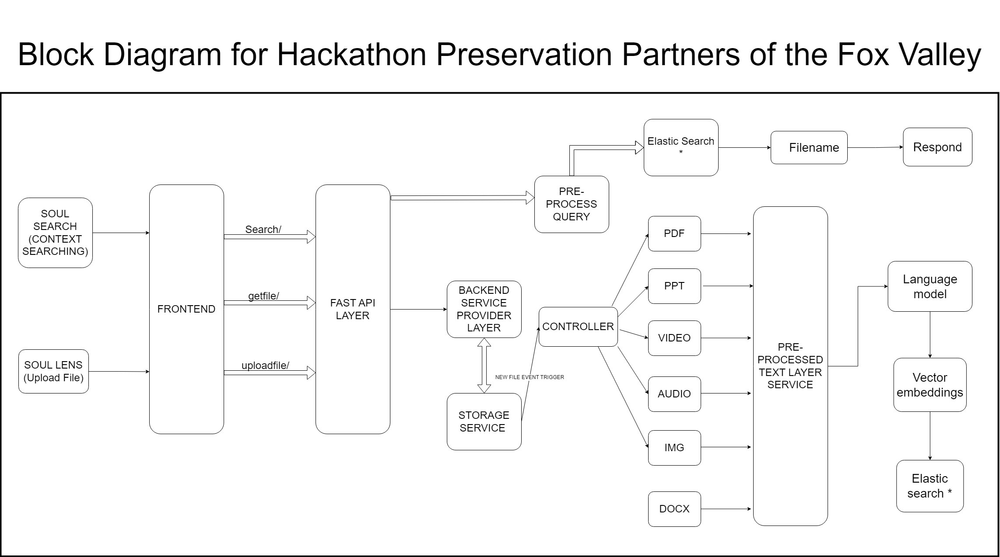

# Team SouL: Fox Valley

## Problem Statement
[Digital Records Management for Museums and Historical Sites](https://docs.google.com/document/d/1kqOwkuZZAIePUPsvH6YkLQbFQpEA14E9JVRkMjyZ-Wg/edit#heading=h.crtjgri39oee)

## Inspiration

This project is inspired by the work of Preservation Partners of the Fox Valley, a non-profit organization that runs five museums and historical sites. The organization, dedicated to preserving the rich history of the Fox Valley, has a significant collection of digital records dating back to the 1980s. However, the current state of organization and accessibility of these records **hinders the organization's research efforts and impacts its ability to create compelling exhibits and programs**.
### Impact
Our solution is designed to address 100% of the identified challenges faced by Preservation Partners. By ensuring the comprehensive retrieval of documents, images, audio files, and other records, our system aims to make a significant positive impact on the community.
### Complexity
We acknowledge and prioritize tackling complex issues. Our solution does not just scratch the surface; it delves deep into the intricacies of organizing and searching digital records effectively, providing a nuanced and sophisticated resolution.
We are inspired to build a system that will help Preservation Partners to organize and search their digital records more easily. This system will allow Preservation Partners to:
* ***Find*** specific documents, images, audio files, video files, and other records quickly and easily.
* ***Organize*** their records in a way that is meaningful to them and their researchers.

Here are some specific examples of how this system could be used:
* Search for all documents that mention a *specific person, event, or location* from all the documents within seconds.
* Search for all *images and documents* related to a particular topic.
* Search for all newspaper articles about a local *historical event*.
* Organize a collection of historical photos by *date, location, or subject*.
### Security
- We have diligently plugged all potential security holes to prevent unauthorized data extraction. Our system ensures the integrity and confidentiality of Preservation Partners' valuable records.
- Additionally, we implemented a robust role-based security model, we ensure that access to sensitive information is strictly controlled based on predefined roles. This provides an additional layer of protection, leveraging existing AuthO foundations.

We are driven by the inspiration provided by Preservation Partners of the Fox Valley. Our solution aims to empower them in preserving and sharing the history of the Fox Valley by providing an efficient, secure, and user-friendly system.

## How we built it?
The backend solution for SouLSearch is built using:
* Python
* FastAPI
* Elasticsearch
* Powered by Machine Learning and Deep Learning
More onto our ML/DL solution architecture:

The front-end solution for SouLSearch is built using:
* JavaScript
* AngularJS
* PrimeNG
* Auth0

Our End-to-End System Design diagram:

## Challenges we ran into
One of the main challenges of this project was shipping our code into Docker images. This was a time-consuming process, as we had to learn how to create and manage Docker images. Additionally, we had a hard time installing Elasticsearch on Windows local machines using Docker and zip installations. This consumed a significant amount of time and delayed backend development in general.

However, we believe that shipping our code into containers would have been a valuable investment of time, as it would have made our code more portable, scalable, and maintainable. Docker containers are a lightweight virtualization technology that allows us to package our code and all of its dependencies into a single, isolated unit. This makes it easy to deploy and run our code on any machine that has Docker installed. Docker containers offer a number of benefits, including portability, scalability, and maintainability.

## Accomplishments that we're proud of
* ***End-to-end flow***: Despite the challenges we faced, we were able to complete the end-to-end flow of the project, from data ingestion and processing to search and visualization.
* ***ElasticSearch implementation***: We are super proud of our implementation of Elasticsearch and its response time. We were able to achieve a fast and reliable search experience, even with a large dataset of mixed file types.
* ***Machine learning models***: We efficiently implemented machine learning models to extract important contents from files. This logic was essential to the overall conversion process, which involved converting everything to text, dividing it into chunks, and storing it as vector embeddings in Elasticsearch.
* ***Frontend***: We are also proud of our frontend development. We created a user-friendly and intuitive interface that allows users to easily search and browse the digitized collection.

## What we learned
* We learned a lot about Docker containers and Elasticsearch, and we are confident that we can use this knowledge to develop future projects.
* We worked effectively as a team, and we were able to overcome challenges together.
* We are passionate about the work that we do, and we are committed to making a positive impact on the world.
* Having right set of people working by you on the same goal with the same energy can do wonders!!!

## Whats Next?
We are excited to continue developing and improving our system. Here are some of our next steps:

* Containerize our code into Docker containers and deploy it as a service. This will make our code more portable, scalable, and maintainable.
* Scale our solution on the cloud using AWS or GCP. This will allow us to handle larger datasets and more concurrent users.
* Design a CI/CD pipeline to automatically create containers and deploy them to the cloud using Jenkins or GitHub Actions. This will streamline our development and deployment process.

In addition to these next steps, we are also interested in exploring the following:

* Improving the accuracy of our machine learning models for extracting important contents from files. This would make it easier for users to find the information they are looking for.
* Developing new features for our frontend interface, such as the ability to browse and visualize the search results in different ways. This would make our system more user-friendly and informative.

## Authors

- [@Amey Bhilegaonkar](https://www.linkedin.com/in/amey-bhilegaonkar/)
- [@Rohan Awhad](https://www.linkedin.com/in/rohanawhad/)
- [@Saurabh Zinjad](https://www.linkedin.com/in/saurabhzinjad/)
- [@Thinh Tran](https://www.linkedin.com/in/cong-thinh-tran/)
- [@Dat Nguyen](https://www.linkedin.com/in/dat-nguyen-6b26ab266/)

